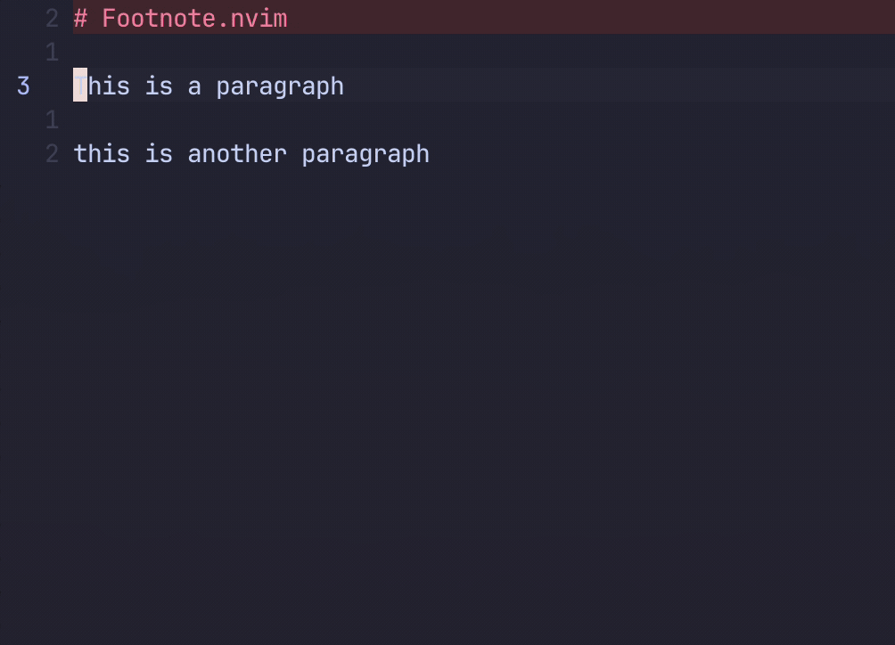

# Footnote.nvim

> [!WARNING]
> This plugin is still under active development. Some features are not fully implemented, and issues are expected.

A neovim plugin to elevate markdown footnote editing experiences.



## ✨ Features

- Create ordinal footnote
- Organize footnotes & cleanup undefined footnotes `(WIP)`
- Goto next/prev footnote `(WIP)`

## ⚡️ Requirements

`(WIP)`

## 📦 Installation

install using [lazy.nvim](https://github.com/folke/lazy.nvim):

```lua
return {
  'chenxin-yan/footnote.nvim',
  ft = 'markdown',
  config = function()
    require('footnote').setup {
      -- add any configuration here
    }
  end,
}
```

## ⚙️ Configuration

Default Configuration:

```lua
local default = {
  keys = {
    new_footnote = '<C-f>',
    organize_footnotes = '<leader>of',
    next_footnote = ']f',
    prev_footnote = '[f',
  },
  organize_on_save = true,
}
```

You can disable any keymaps by setting it to `''`, and you can also manually set these keymaps.

<details><summary>Set Keymaps Manually</summary>

```lua
require('footnote').setup {
  keys = {
    new_footnote = '',
    organize_footnotes = '',
    next_footnote = '',
    prev_footnote = '',
  },
}
vim.keymap.set(
  { 'i', 'n' },
  opts.keys.new_footnote,
  "<cmd>lua require('footnote').new_footnote()<cr>",
  { buffer = 0, silent = true, desc = 'Create markdown footnote' }
)
vim.keymap.set(
  { 'n' },
  opts.keys.organize_footnotes,
  "<cmd>lua require('footnote').organize_footnotes()<cr>",
  { buffer = 0, silent = true, desc = 'Organize footnote' }
)
vim.keymap.set(
  { 'n' },
  opts.keys.next_footnote,
  "<cmd>lua require('footnote').next_footnote()<cr>",
  { buffer = 0, silent = true, desc = 'Next footnote' }
)
vim.keymap.set(
  { 'n' },
  opts.keys.prev_footnote,
  "<cmd>lua require('footnote').prev_footnote()<cr>",
  { buffer = 0, silent = true, desc = 'Previous footnote' }
)
```

</details>

## 🚀 Usage

- **Create new footnote**: `require('footnote').new_footnote()`
  - After editing footnote, you can use `<C-o>`/`<C-i>` to navigate between footnote and its reference

## 💡 Inspiration

- README.md inspired by [Folke](https://github.com/folke)
- [markdowny.nvim](https://github.com/antonk52/markdowny.nvim)
